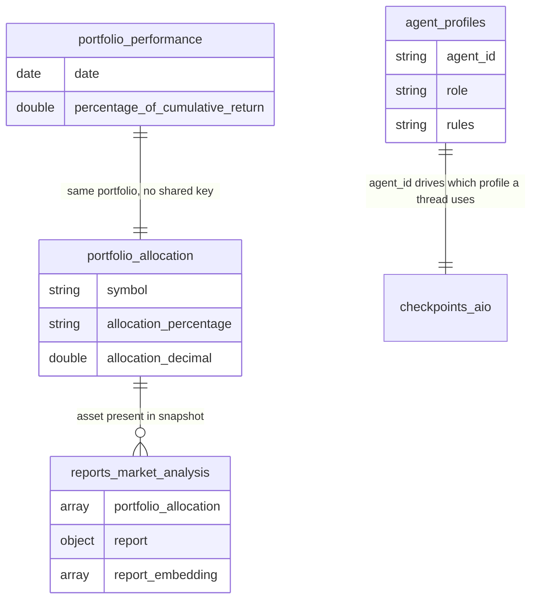

# EDD — Entity Document Diagram

MongoDB data model for the Capital Markets Market Assistant, a LangGraph
ReAct agent backend.

Database: `agentic_capital_markets` (configurable via `DATABASE_NAME`). Field
types below were sampled from the live seeded database, not inferred from
the export files.

---

## Entity overview

| Collection | Docs | Written by | Read by |
| --- | --- | --- | --- |
| `agent_profiles` | 9 | Manual / seed | `AgentProfiles` (system prompt lookup) |
| `portfolio_allocation` | 10 | Manual / seed | `get_portfolio_allocation_tool` |
| `portfolio_performance` | 2,252 | Manual / seed | `get_portfolio_ytd_return_tool` |
| `reports_market_analysis` | 1 | Upstream report generator (not in this repo) | `market_analysis_reports_vector_search_tool`, `get_vix_closing_value_tool` |
| `reports_market_news` | 2 | Upstream report generator | `market_news_reports_vector_search_tool` |
| `reports_market_sm` | 2 | Upstream report generator | `market_social_media_reports_vector_search_tool` |
| `risk_profiles` | 4 | Manual / seed | **nothing** — see Known inconsistencies |
| `checkpoints_aio` / `checkpoint_writes_aio` | Variable | `AsyncMongoDBSaver` (LangGraph) | LangGraph, `CheckpointerMemoryJobs` |

The three `reports_*` collections share one schema (see below), distinguished
only by which vector index and tool point at them.

---

## `agent_profiles`

One document per agent persona; `AgentProfiles` looks up by `agent_id` and
assembles the system prompt from the other fields.

| Field | Type | Notes |
| --- | --- | --- |
| `_id` | ObjectId | |
| `agent_id` | string | e.g. `"DEFAULT"`, `"MARKET_ASSISTANT_AGENT"` — the live agent's profile |
| `profile` | string | Human-readable name |
| `role` | string | e.g. `"Expert Advisor"` |
| `kind_of_data` | string | |
| `motive` | string | |
| `instructions` | string | |
| `rules` | string | e.g. length/format constraints on the final answer |
| `goals` | string | |

## `portfolio_allocation`

Static current-state allocation, one document per holding.

| Field | Type | Notes |
| --- | --- | --- |
| `_id` | ObjectId | |
| `symbol` | string | Ticker, e.g. `"SPY"` |
| `allocation_percentage` | string | `"25%"` — display string, not numeric |
| `allocation_number` | int | `25` |
| `allocation_decimal` | double | `0.25` |
| `description` | string | |
| `asset_type` | string | e.g. `"Equity"` |

## `portfolio_performance`

Daily return time series. `get_portfolio_ytd_return_tool` diffs the first and
latest `percentage_of_cumulative_return` in the current year.

| Field | Type | Notes |
| --- | --- | --- |
| `_id` | ObjectId | |
| `date` | date | |
| `percentage_of_daily_return` | double | |
| `percentage_of_cumulative_return` | double | |

## `reports_market_analysis` / `reports_market_news` / `reports_market_sm`

Generated externally (not by any script in this repo) and inserted with a
pre-computed embedding. Vector search matches on `report_embedding`; a
recency fallback (most recent `timestamp`) applies when nothing matches
semantically.

| Field | Type | Notes |
| --- | --- | --- |
| `_id` | ObjectId | |
| `portfolio_allocation` | array\<object\> | Snapshot of allocation at report time — `{asset, description, allocation_percentage}`, a *different* shape from the standalone `portfolio_allocation` collection (`symbol` there, `asset` here) |
| `report` | object | Structured findings, e.g. `asset_trends: [{asset, fluctuation_answer, diagnosis}]`. VIX value lives somewhere in this object — `get_vix_closing_value_tool` extracts it. |
| `updates` | array\<string\> | Free-text log of the report-generation pipeline's own steps, e.g. `"[Action] Using risk profile: BALANCED - ..."` |
| `timestamp` | date | |
| `date_string` | string | Redundant human-readable copy of `timestamp` |
| `report_embedding` | array\<double\> | 1024 dims, `voyage-finance-2`, cosine |

Vector indexes (all created via `backend/agent/db/vector_search_index_creator.py`,
already the modern `type: "vectorSearch"` format):

| Index | Collection | Path | Dims | Similarity |
| --- | --- | --- | --- | --- |
| `reports_market_analysis_report_embedding_index` | `reports_market_analysis` | `report_embedding` | 1024 | cosine |
| `reports_market_news_report_embedding_index` | `reports_market_news` | `report_embedding` | 1024 | cosine |
| `reports_market_sm_report_embedding_index` | `reports_market_sm` | `report_embedding` | 1024 | cosine |

## `risk_profiles`

| Field | Type | Notes |
| --- | --- | --- |
| `_id` | ObjectId | |
| `risk_id` | string | `HIGH_RISK`, `BALANCED`, `CONSERVATIVE`, `LOW_RISK` |
| `short_description` | string | |
| `active` | bool | Exactly one is `true` at a time (`BALANCED`, in the seed data) |

## `checkpoints_aio` / `checkpoint_writes_aio`

Managed entirely by `langgraph-checkpoint-mongodb`'s `AsyncMongoDBSaver`.
Keyed by `thread_id`, formatted `thread_YYYYMMDD_HHMMSS`.
`CheckpointerMemoryJobs` runs daily at 04:00 UTC and deletes every
`thread_id` that doesn't contain today's date, from both collections. Treat
as opaque — don't hand-edit.

---

## Relationships

All relationships are logical, not enforced.

## Known inconsistencies

1. **`risk_profiles` is seeded but never queried.** The README lists it as a
   collection to create, and 4 real documents exist (one marked `active`),
   but no tool, route, or service in this repository reads it. When the
   agent's answer references a specific risk profile (e.g. "your BALANCED
   risk profile"), that comes from free text already embedded in
   `reports_*.updates` or `.report` — written by whatever upstream process
   generates those reports — not from a live lookup of this collection.

2. **`portfolio_allocation` the field and `portfolio_allocation` the
   collection use different key names for the same concept.** The standalone
   collection uses `symbol`; the array embedded in each `reports_*` document
   uses `asset`. Same tickers, different key, if you're writing code that
   reads both.

3. **Collection-name fallback defaults drifted from the seed data once
   already.** `react_agent_tools.py` and `react_agent_console.py` both
   defaulted `PORTFOLIO_ALLOCATION_COLLECTION`/`PORTFOLIO_PERFORMANCE_COLLECTION`
   to `portfolioAllocation`/`portfolioPerformance` (camelCase) — wrong
   whenever those two env vars are unset, since the seed data and every
   other collection-name default in the codebase are snake_case. Fixed to
   match.

Update this section if any of these are fixed — otherwise it becomes
misleading.
