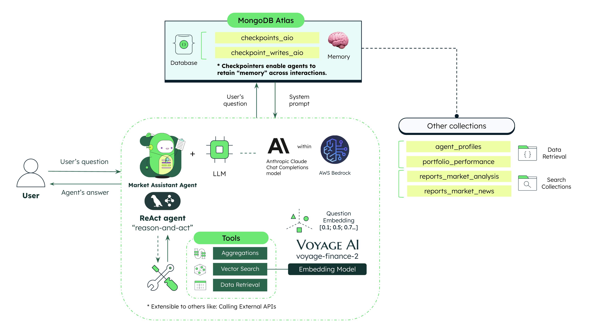

# Capital Markets - Market Assistant ReAct Agent Chatbot Service

This repository hosts the backend for the **Capital Markets - Market Assistant ReAct Agent Chatbot Service** service.

## Where Does MongoDB Shine?

To be completed!

## High Level Architecture



## MongoDB Key Features

- **Time Series** - ([More info](https://www.mongodb.com/products/capabilities/time-series)): For storing market data in a time series format.
- **Atlas Vector Search**  ([More info](https://www.mongodb.com/products/platform/atlas-vector-search)): For enabling vector search on financial news data.

## Tech Stack

- [MongoDB Atlas](https://www.mongodb.com/atlas/database) for the database
- [VoyageAI](https://voyage.ai/) for using best-in-class embedding models
- [LangGraph](https://langchain-ai.github.io/langgraph/) as low-level orchestration framework for building controllable agents
- [LangGraph Checkpoint MongoDB](https://langchain-ai.github.io/langgraph/how-tos/persistence_mongodb/) for storing and retrieving agent checkpoints (Long-term memory)
- [LangChain](https://python.langchain.com/docs/introduction/) as framework for developing applications powered by large language models (LLMs)
- [Anthropic Claude models](https://docs.aws.amazon.com/bedrock/latest/userguide/model-parameters-claude.html) for chat completions
- [Scheduler](https://pypi.org/project/scheduler/) for scheduling jobs
- [Pytz](https://pypi.org/project/pytz/) for timezone handling
- [Rich](https://rich.readthedocs.io/en/stable/) for beautiful terminal output (console agent)
- [FastAPI](https://fastapi.tiangolo.com/) for the backend framework
- [Uvicorn](https://www.uvicorn.org/) for ASGI server
- [Pydantic](https://pydantic-docs.helpmanual.io/) for documenting FastAPI Swagger schemas
- [Boto3] (https://boto3.amazonaws.com/v1/documentation/api/latest/index.html) AWS SDK for Python
- [Botocore](https://botocore.amazonaws.com/v1/documentation/api/latest/index.html) for serving as the low-level interface to AWS services
- [Poetry](https://python-poetry.org/) for dependency management
- [Docker](https://www.docker.com/) for containerization

## Prerequisites

Before you begin, ensure you have met the following requirements:

- **MongoDB Atlas** account - [Register Here](https://account.mongodb.com/account/register)
- **Python 3.10 or higher**
- **Poetry** (install via [Poetry's official documentation](https://python-poetry.org/docs/#installation))

## Setup Instructions

### Step 1a: Set Up MongoDB Database and Collections

1. Log in to **MongoDB Atlas** and create a database named `agentic_capital_markets`. Ensure the name is reflected in the environment variables.

> **_Note:_** For creating the time series collection, you can run the following python script located in the `backend/loaders/db/` directory: `create_time_series_collection.py`. Make sure to parametrize the script accordingly.

### Step 1b: Set Up Vector Search Index

1. Create the vector search index for the `financial_news` collection.

> **_Note:_** For creating the vector search index, you can run the following python script located in the `backend/loaders/db/` directory: `vector_search_idx_creator.py`. Make sure to parametrize the script accordingly.


### Step 2: Add MongoDB User

Follow [MongoDB's guide](https://www.mongodb.com/docs/atlas/security-add-mongodb-users/) to create a user with **readWrite** access to the `agentic_capital_markets` database.

## Configure Environment Variables

Create a `.env` file in the `/backend` directory with the following content:

```bash
MONGODB_URI = "mongodb+srv://<REPLACE_USERNAME>:<REPLACE_PASSWORD>@<REPLACE_CLUSTER_NAME>.mongodb.net/"
DATABASE_NAME="agentic_capital_markets"
APP_NAME="ist.demo.capital_markets.react.agent.chatbot"
VOYAGE_API_KEY="YOUR_VOYAGE_API_KEY"
TAVILY_API_KEY = "YOUR_TAVILY_API_KEY"
AWS_REGION="YOUR_AWS_REGION"
CHAT_COMPLETIONS_MODEL_ID="anthropic.claude-3-haiku-20240307-v1:0"
EMBEDDINGS_MODEL_ID="voyage-finance-2"
AGENT_PROFILES_COLLECTION = "agent_profiles"
CHECKPOINTS_AIO_COLLECTION = "checkpoints_aio"
CHECKPOINTS_WRITES_AIO_COLLECTION = "checkpoint_writes_aio"
REPORTS_COLLECTION_MARKET_ANALYSIS = "reports_market_analysis"
REPORT_MARKET_ANALISYS_VECTOR_INDEX_NAME = "reports_market_analysis_report_embedding_index"
REPORTS_COLLECTION_MARKET_NEWS = "reports_market_news"
REPORT_MARKET_NEWS_VECTOR_INDEX_NAME = "reports_market_news_report_embedding_index"
REPORT_VECTOR_FIELD = "report_embedding"
PORTFOLIO_PERFORMANCE_COLLECTION = "portfolio_performance"
```

## Running the Backend

### Virtual Environment Setup with Poetry

1. Open a terminal in the project root directory.
2. Run the following commands:
   ```bash
   make poetry_start
   make poetry_install
   ```
3. Verify that the `.venv` folder has been generated within the `/backend` directory.

### Start the Backend

To start the backend service, run:

```bash
poetry run uvicorn main:app --host 0.0.0.0 --port 8004
```

> Default port is `8004`, modify the `--port` flag if needed.

## Running with Docker

Run the following command in the root directory:

```bash
make build
```

To remove the container and image:

```bash
make clean
```

## API Documentation

You can access the API documentation by visiting the following URL:

```
http://localhost:<PORT_NUMBER>/docs
```
E.g. `http://localhost:8004/docs`

> **_Note:_** Make sure to replace `<PORT_NUMBER>` with the port number you are using and ensure the backend is running.

## Common errors

- Check that you've created an `.env` file that contains the required environment variables.

## Future tasks

- [ ] Add tests
- [ ] Evaluate SonarQube for code quality
- [ ] Automate the deployment process using GitHub Actions or CodePipeline
